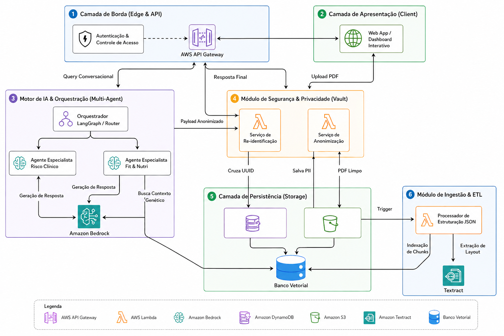

# FIAP - Faculdade de Informática e Administração Paulista

 

# Genera Intelligence: RAG Multimodelo para Laudos Genéticos (Sprint 2)

## Grupo: Squad AI Engineering

## 👨‍🎓 Integrantes: 
- <a href="https://www.linkedin.com/in/arthur-alentejo">Arthur Guimarães Alentejo</a>
- <a href="https://www.linkedin.com/in/michaelrodriguess">Michael Rodrigues</a>
- <a href="https://www.linkedin.com/in/nathalia-vasconcelos-18a390292/">Nathalia Vasconcelos</a> 

## 👩‍🏫 Professores:
### Tutor(a) 
- <a href="#">Caique (CaiqueFiap-2026)</a>
### Coordenador(a)
- <a href="https://www.linkedin.com/in/andregodoichiovato/">André Godói</a>

---

## ⚠️ Nota Técnica Arquitetural (Sprint 2)
Para a avaliação desta etapa focada em Inteligência Artificial, a equipe adotou uma estratégia de mitigação de risco no pipeline de ingestão. Em vez de executar o OCR (Textract) em tempo real nos arquivos PDF de origem, **os laudos foram previamente convertidos e padronizados no arquivo `proposta_estrutura_de_dados.json`**. 

Esta decisão permite que a equipe concentre todos os esforços no que realmente importa nesta Sprint: a **implementação do motor RAG, a orquestração de múltiplos agentes via LangGraph e a engenharia de prompts**, garantindo respostas semânticas altamente precisas e ancoradas em dados estruturados.

---

## 📜 Descrição
O projeto visa resolver o gargalo de interpretação de dados genéticos do produto Genera (Grupo Dasa). Atualmente, os laudos são entregues em arquivos PDF extensos e repletos de terminologias técnicas, o que dificulta a compreensão do paciente e a tomada de decisão ágil pelo médico. 

A nossa solução é uma camada de inteligência baseada em **RAG (Retrieval-Augmented Generation)**. Através de um Dashboard interativo aliado a um assistente conversacional inteligente, o usuário pode "conversar" com o seu DNA, recebendo explicações em linguagem simples, recomendações personalizadas e visualizações intuitivas de riscos e predisposições.

## 📺 Apresentação do Projeto
* **Sprint 2 (Atual - Motor RAG & Agentes):** [Link do YouTube será inserido aqui]
* **Sprint 1 (Fundação e Arquitetura):** [Link para o YouTube](https://youtu.be/mASJnbO3dqo)

### A Solução Integrada
Utilizamos IA e arquitetura em nuvem para:
- **Extrair e Estruturar:** Converter PDFs técnicos em JSONs organizados por categorias de saúde (simulado nesta Sprint).
- **Interpretar (Foco Atual):** Utilizar múltiplos agentes especialistas orquestrados pelo **LangGraph** para responder a dúvidas específicas (ex: Agente de Nutrição, Agente de Risco Clínico).
- **Garantir Governança:** Aplicar *guardrails* e *system prompts* que impedem alucinações da IA e emitem disclaimers médicos apropriados.

## 👥 Perfis de Usuários (Personas)

1. **🧬 O Paciente (Usuário Final)**
   * **A Dor:** Recebe um laudo denso e sente-se perdido perante os termos técnicos.
   * **O Caso de Uso:** Acessa o chat e pergunta: *"Com base no meu painel Genera Nutri, como o meu corpo reage à cafeína?"*. O RAG traduz o alelo rs762551 numa recomendação prática para o dia a dia.
   * **O Valor:** Autonomia e engajamento com a própria saúde.

2. **🩺 O Profissional de Saúde (Médico/Nutricionista)**
   * **A Dor:** Tempo de consulta limitado para cruzar dezenas de variantes genéticas.
   * **O Caso de Uso:** Pesquisa direta na base de conhecimento sobre interações medicamentosas (Farma) sem ter de abrir PDFs de 60 páginas.
   * **O Valor:** Agilidade e assertividade na tomada de decisão clínica.

---

## 🏗 Arquitetura da Solução

A solução baseia-se na infraestrutura **AWS**, utilizando modelos de linguagem via **Amazon Bedrock**, orquestração com **LangGraph** e bases vetoriais para a busca semântica.

### Diagrama de Arquitetura

## 🚀 Entregáveis e Foco da Sprint 2

Nesta fase, a implementação centrou-se em materializar o Motor de IA:

* **1. Orquestração LangGraph:** Implementação de um nó roteador (Supervisor) que encaminha as requisições para o agente especialista mais indicado.
* **2. Implementação RAG:** Geração de *embeddings* a partir das descrições detalhadas do JSON para alimentar o banco vetorial, garantindo *grounding*.
* **3. Governança e Guardrails:** Engenharia de prompts rigorosa para evitar a prescrição médica indevida e assegurar a qualidade (NLP) da resposta.
* **4. Interface de Chat:** Front-end funcional permitindo a interação natural e exibindo as *fontes genéticas* utilizadas na resposta.

***

## 📁 Estrutura de Pastas

- **.github**: Workflows de automação e CI/CD.
- **assets**: Diagramas de arquitetura e logos.
- **config**: Configurações de ambiente e definições.
- **document**: Laudos originais em PDF e relatórios de Governança.
- **proposta_estrutura_de_dados.json**: Mock de dados estruturados utilizados para alimentar o banco vetorial.
- **scripts**: Scripts de povoamento do Vector Store e limpeza de texto.
- **src**: Código-fonte:
  - `/backend`: Core do motor RAG e LangGraph.
  - `/frontend`: Interface do assistente de chat.

## 🔧 Como executar o projeto

1. Clone o repositório.
2. Crie e ative um ambiente virtual Python (`python -m venv .venv`).
3. Instale as dependências contidas no backend (ex: `pip install -r src/backend/requirements.txt`).
4. Execute o script de *seed* da base vetorial localizado em `/scripts`.
5. Inicie a API e a interface de usuário (ver README específicos dentro de `/src`).

## 🗃 Histórico de Lançamentos

* **0.2.0 - 19/05/2026** - Sprint 2: Implementação do motor RAG, Agentes LangGraph, interface de Chat e políticas de Governança. Ingestão de dados estruturados via arquivo JSON.
* **0.1.0 - 24/04/2026** - Sprint 1: Estruturação arquitetural do projeto, definição em AWS e pipeline conceitual de anonimização.

## 📋 Licença

<a property="dct:title" rel="cc:attributionURL" href="https://github.com/agodoi/template">MODELO GIT FIAP</a> por <a rel="cc:attributionURL dct:creator" property="cc:attributionName" href="https://fiap.com.br">Fiap</a> está licenciado sobre <a href="http://creativecommons.org/licenses/by/4.0/?ref=chooser-v1" target="_blank" rel="license noopener noreferrer" style="display:inline-block;">Attribution 4.0 International</a>.
